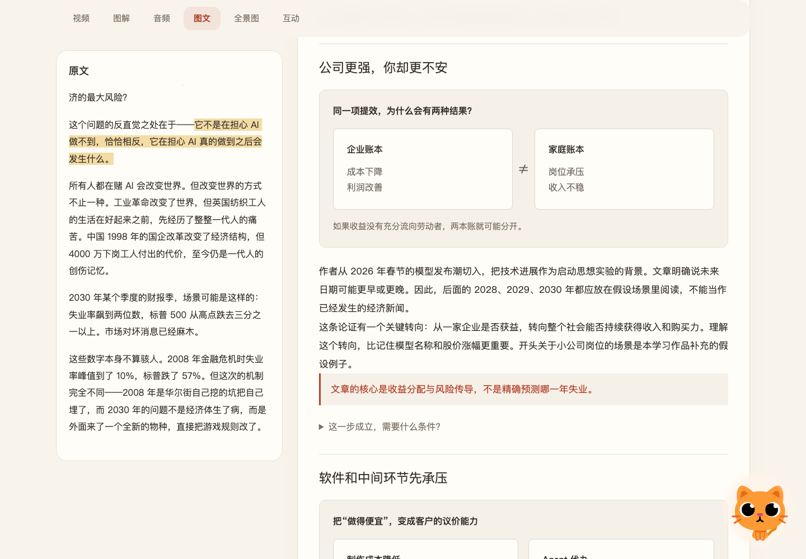
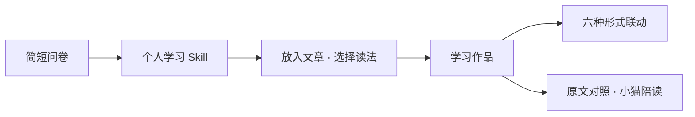
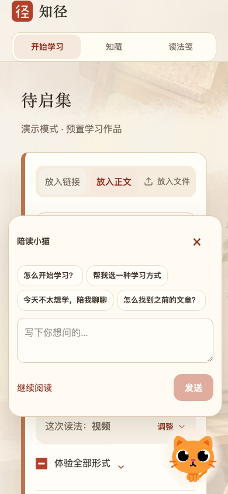

<div align="center">
  
  <h1>知径 · Zhijing</h1>
  <p><strong>给好奇心，留一个小角落。</strong></p>
  <p>把一篇长文，变成你愿意读下去的样子。</p>
  <p>
    <a href="https://app.chainvalley.top/zhijing/?start=welcome">从头体验</a> ·
    <a href="#开始运行">本地运行</a> ·
    <a href="docs/21-运行与完整打包.md">部署与打包</a> ·
    <a href="CONTRIBUTING.md">继续打磨</a>
  </p>
</div>


## 把长文变得更容易开始

知径是一个个人化学习网站。用一次简短问卷了解你的习惯，形成可查看、可修改的学习规则；再把文章组织成视频、图解、音频、图文、全景图或互动内容。

这里不把人固定划分成某种“学习类型”，也不把练习当成看完文章的门槛。偏好可以调整，原文可以随时对照，小猫在一旁安静陪读。

| 一个内容，六种打开方式 |                                              |
| ---------------------- | -------------------------------------------- |
| 视频 / 音频            | 跟着讲解理解内容，支持时间和章节定位。       |
| 图文 / 图解            | 自己掌握阅读速度，看到观点、关系和成立条件。 |
| 全景图 / 互动          | 查看全文脉络，比较情境、翻阅复习卡。         |



## 一个连贯的学习过程



- **一次了解，随时可改。** 8 个问题分为 3 组，个人学法与“这次读法”分开。
- **少做一次选择。** 默认打开选定的主要形式，其他形式按需切换。
- **同一个阅读位置。** 文章案例的视频、图解等围绕同一章节联动。
- **能回到作者的话。** 桌面左侧展示全文，并高亮当前内容对应的句子。
- **有陪伴，不催促。** 小猫可拖动，点击后在上方对话；开始聊天后收起初始快捷问题。

<details>
<summary>看看手机上的陪读小猫</summary>
<br />

</details>

## 当前是什么版本？

**当前默认走演示模式。** 输入任意非空内容，会经过准备动画，进入已经制作好的《窗口期可能只剩五年》学习作品，**不是为该次输入实时生成答案**。

源码同时包含真实文章提取、学法设计、内容分析、配音、视频制作、学习记录及陪读接口，但这不等于当前默认入口已启用任意文章的端到端生产。AI 学法设计与小猫对话需要有效模型配置。

已有的原文、讲稿、图解、视频、音轨、字幕和动效资源随仓库提供，可以重建完整案例。私人数据、密钥和私人音色参考不包含在内。偏好适配不等于已经证明学习效率提升。

## 开始运行

使用 **Node.js 24**，建议 macOS / Linux 或 Windows WSL。

```sh
git clone https://github.com/lizx-lzx/zhijing.git
cd zhijing
npm ci
npm run demo:install
cp .env.example .env.zhijing
npm run demo:build
```

分别在两个终端启动：

```sh
npm run api
```

```sh
npm run dev:demo
```

打开 [localhost:3000/zhijing](http://localhost:3000/zhijing/?start=welcome)。仅构建和浏览预置作品不需要重新生成媒体；模型配置与基础规则降级方式见[运行说明](docs/21-运行与完整打包.md)。

录演示时，在网页内按 **Option + Shift + R**（Mac）或 **Alt + Shift + R**（Windows），即可回到欢迎页反复走完整流程，不清空已有作品。

## 项目结构

```text
app/                         页面、布局与视觉样式
components/                  问卷、书房、学习页、原文、小猫
lib/                         学习规则、形式联动、路由与状态
server/                      内容提取、模型、配音、存储与 API
  prompts/                   各环节的提示词
experiments/
  openmaic-preview/          六形式文章作品及冻结媒体
  article-motion/            网页动效、渲染脚本与成片
public/                      图标、书房图片、小猫及静态资源
tests/ · scripts/            测试、验收与构建工具
deploy/                      自有服务器部署脚本
docs/                        产品思路、研究、设计与开发记录
```

前端使用 React、Vinext / Vite、Motion；后端使用 Node.js、SQLite，媒体管线使用 Playwright 与 FFmpeg。OpenMAIC 的部分生成和渲染包用于作品环节，不是把其完整课堂产品换一个名称。

## 从想法到现在

[产品决策](docs/01-对话思路与产品决策.md) · [开发与源码导航](docs/02-开发思路、最终方案与源码导航.md) · [研究依据](docs/03-研究结论与下一阶段落地方案.md) · [问卷与 Skill](docs/04-问卷与个人学习Skill映射-v0.2.md)

[宣纸留白](docs/14-宣纸留白视觉统一.md) · [界面减法](docs/10-界面减法.md) · [陪读小猫](docs/20-陪读小猫.md) · [完整运行与部署](docs/21-运行与完整打包.md)

历史文档记录各阶段状态；以本 README 和当前代码为准。GitHub 保存源码，线上仍部署在用户自有服务器，不会因推送而自动发布。

---

本仓库初始为私有项目，尚未为全部内容选择统一开源许可证。文章、角色与依赖保留各自权利和来源，详见 [第三方代码与素材说明](THIRD-PARTY.md)。
