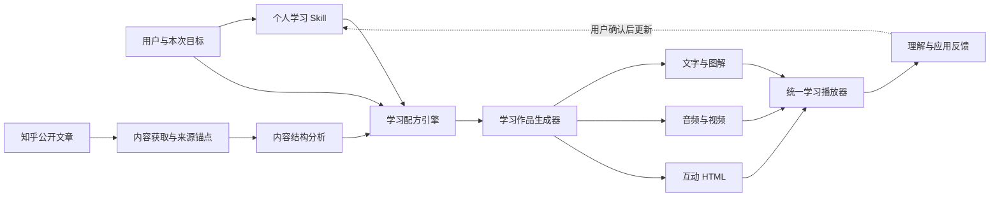

# 知径：开发思路、最终方案与源码导航

## 2026-09-07 实现更新

以下旧章节保留作为原型阶段的开发记录，不再代表新版能力。新版发布证据以 [实施与验收](05-完整产品实施与验收.md) 为准。

新版实际代码分工：

- `lib/domain.ts`：问卷、规则接口、长期 Skill、仅本次覆盖及导出。
- `components/learning-onboarding.tsx`：8 题分组问卷与规则确认。
- `components/learning-workbench.tsx`：链接、正文、文本导入、临时偏好、学习库。
- `components/learning-lesson.tsx`：图文、音视频、网页动画、来源、下载与可选练习。
- `server/source.mjs`：知乎白名单、内容提取、段落编号和失败提示。
- `server/prompts/`：设计 Skill、内容分析、个性化编排、独立核对四个单一职责模块。
- `server/model.mjs`：真实模型调用与结构校验、引用摘录逐字核验。
- `server/player.mjs`、`server/media.mjs`：共用章节、真实配音、HTML 动画、FFmpeg 视频与字幕。
- `server/store.mjs`、`server/index.mjs`：SQLite、会话隔离、恢复码、任务持久化、限额和私有媒体接口。
- `deploy/`：自有服务器的服务、Nginx、私有配置传输，密钥不入库。
- `tests/`、`scripts/acceptance.mjs`：自动检查与真实模型对照。

网页和 API 分进程；私有数据放在发布目录外。模型只生成结构化内容，网页代码由可信渲染器提供，不执行原文或模型提供的代码。生成失败不伪造成功，知乎受限时由用户粘贴正文，不绕过访问限制。

## 以下为 2026-08-29 原型记录

> 状态：当前实现说明与下一阶段技术方案  
> 日期：2026-08-29  
> 当前线上 UI 基线：`b7c3af8`  
> 公网地址：<https://app.chainvalley.top/zhijing/>

## 1. 先说明当前真实状态

当前仓库是一套已经部署、可以完整操作的前端验证原型。它真实实现了首页、一次性问卷、Style 体验、个人 Skill 结果、工作台、文章链接入口、学习配方选择和学习页面。

以下能力尚未实现，界面中的相关过程目前是演示：

- 没有抓取或解析知乎正文；
- 没有调用大模型生成个人 Skill 或学习内容；
- 没有账号系统和服务端数据库；
- 没有真实生成图片、音频、视频或互动 HTML；
- 没有长期学习记录和效果评估。

源码中用 `setTimeout` 模拟“识别文章”和“搭建学习路径”的等待过程，用 `localStorage` 保存个人建档和演示完成状态。这个边界在界面中也有明确提示，没有把演示数据伪装成真实处理结果。

## 2. 最终产品方案

完整平台应由一条可以追溯的学习编译链路构成：



核心不是一次调用一个模型，而是让每个阶段拥有清楚的输入、输出和证据边界。

### 2.1 内容获取层

职责：接收知乎公开链接，获取允许处理的正文、标题、作者、图片、章节结构和原文位置。

这一层必须保存来源锚点，后续每段学习内容都能区分：

- 原文事实与观点；
- AI 的解释、类比和重组；
- 经过核验的外部补充。

正式实现前需要再次核对知乎当时有效的公开访问、版权、Robots 和接口规则，不能把当前演示链接判断当成长期稳定接口。

### 2.2 内容分析层

职责：把文章还原成知识结构，而不是先压缩成一段摘要。建议产出：

- 文章中心问题；
- 事实、解释、推断、预测和价值判断；
- 概念、因果、对比、条件和步骤关系；
- 案例、情绪段落和行动建议；
- 可独立练习、可被反馈影响的知识单元；
- 适合使用或不适合使用的媒体形式。

### 2.3 个人学习 Skill 层

个人 Skill 是用户可见、可修改、可版本化的规则。目标数据结构可以采用下面的形式：

```ts
type PersonalLearningSkill = {
  version: number;
  audience: {
    ageStage?: string;
    accessibility?: string[];
  };
  defaults: {
    goal: "quick-understand" | "build-structure" | "remember" | "apply" | "explain";
    entry: "question" | "map" | "case" | "story" | "definition";
    depth: "light" | "medium" | "deep";
    interaction: "minimal" | "checkpoint" | "constructive" | "dialogue";
    media: Array<"text" | "diagram" | "audio" | "video" | "interactive">;
  };
  avoid: string[];
  evidence: Array<{
    source: "questionnaire" | "style-test" | "learning-result" | "user-edit";
    observation: string;
    confidence: "low" | "medium" | "high";
  }>;
  userConfirmedAt?: string;
};
```

当前代码只把 6 项回答、Style 选择和一次理解回答作为 JSON 保存到浏览器。上述结构是下一阶段的目标方案，不是已存在的数据库结构。

### 2.4 学习配方层

学习配方是当前文章的一次性编排结果。决策优先级应为：

```text
用户明确限制
＞ 本次目标、时间、设备和无障碍条件
＞ 文章内容特征与先验知识
＞ 个人 Skill 的默认偏好
```

这能避免“用户喜欢视频，所以任何文章都生成视频”这种机械匹配。配方应明确入口、顺序、深度、媒体、互动、时长、收束方式和每一项选择的理由。

### 2.5 学习作品生成层

生成器先产出一个统一的中间结构，再由不同渲染器输出文字、关系图、音频、视频或互动模块。建议不要让每种媒体各自从原文重新生成，否则会出现观点漂移和来源无法对齐。

一个最小中间结构可以包含：

```ts
type LearningBlock = {
  id: string;
  purpose: "question" | "map" | "explanation" | "example" | "practice" | "summary";
  sourceAnchors: string[];
  content: string;
  representation: "text" | "diagram" | "audio" | "video" | "interactive";
  optional: boolean;
};
```

所有渲染器共用同一组 `sourceAnchors`，才能保证同一篇文章的图解版、故事版和视频版仍然来自同一知识基础。

### 2.6 学习播放器与反馈层

学习播放器负责把多个模块呈现为一条连续路径，并允许用户在局部切换解释方式。反馈分为两类：

- **体验反馈**：是否愿意继续、是否觉得太慢、是否喜欢这种形式；
- **学习反馈**：能否解释、判断、回忆或迁移到新问题。

只有第二类反馈才可以作为“可能学会”的证据。个人 Skill 的自动更新应默认等待用户确认，避免一次异常状态永久改变用户画像。

## 3. 当前 Demo 的实现结构

当前原型采用单页状态机，所有主要页面都位于 `app/page.tsx`。`view` 状态在下面六个视图间切换：

```text
landing
→ questionnaire
→ style-test
→ skill-result
→ workspace
→ learning
```

### 已实现的交互

| 模块 | 当前实现 |
|---|---|
| 首次入口 | 首页解释价值并进入建档 |
| 简短问卷 | 6 题、逐题作答、未选择不能继续 |
| Style 体验 | 关系图/故事二选一，再回答理解问题 |
| 个人 Skill | 根据回答形成 4 个可见维度的初稿 |
| 本地保存 | `zhijing-learning-profile` 保存个人建档 |
| 工作台 | 粘贴链接或使用演示文章 |
| 学习配方 | 选择目标和时间，显示推荐路径 |
| 学习页面 | 关系图、故事切换、应用判断、来源边界 |
| 完成状态 | `zhijing-sample-completed` 保存演示完成状态 |

### 当前模拟逻辑

| 看起来发生的事情 | 代码实际上做的事情 |
|---|---|
| 正在识别知乎文章 | 等待 850ms 后显示预设来源卡片 |
| 正在搭建学习路径 | 等待 1100ms 后进入固定学习页面 |
| 已调用个人 Skill | 前端根据问卷回答拼接展示字段 |
| 文章阅读时长和类型 | 固定演示文案 |
| 学习内容 | 为验证产品结构而写的示例内容，不代表知乎原文 |

## 4. 技术栈和开发中使用的东西

### 4.1 应用技术

- React 19.2.6 与 TypeScript 5.9；
- Vinext 1.0 beta 与 Vite 8，提供 Next App Router 风格接口和生产构建；
- Tailwind CSS 4 的基础导入，当前主要视觉仍由手写 CSS 完成；
- Lucide React 图标；
- Motion 作为 ReactBits 动效依赖；
- 浏览器 `localStorage` 作为原型阶段的本地状态保存；
- Nginx、systemd 和独立 Node 进程完成自有服务器部署。

Node.js 最低要求为 22.13.0。当前服务器使用独立 Node 24 运行时，应用只监听 `127.0.0.1:4329`，由 Nginx 暴露 `/zhijing/`。

### 4.2 ReactBits 的使用

开发中通过用户已授权的 ReactBits Starter 私有源码接入了两个可编辑组件：

- `ParallaxPills`：首页围绕个人 Skill 卡片展示不同学习路径；
- `StaggeredText`：用于关键文案的渐进出现。

组件源码已经进入项目，不依赖运行时访问私有仓库。接入后做了三类适配：

- 增加客户端组件声明；
- 把随机铰链行为改为确定性计算，避免渲染不稳定；
- 按知径的颜色、节奏、响应式布局和减少动态偏好进行调整。

没有使用 WebGL 或大面积特效。最后又根据奥卡姆剃刀删除了不影响用户判断的小字和装饰性状态说明。

### 4.3 开发与验证工具

- Git 保存原型、服务器部署、ReactBits 优化和界面减法四个阶段；
- GitHub CLI 验证了已授权私有 ReactBits Starter 源码访问；
- Shadcn CLI 用于初始化兼容的组件注册配置，未保留不需要的主题组件；
- ESLint 和生产构建用于静态与编译验证；
- 浏览器实际检查桌面、390px 手机布局和问卷交互；
- SSH、curl、systemd 与 Nginx 检查用于自有服务器发布和回滚验证。

ReactBits 授权 Key 不写入仓库，只允许存在于 Git 忽略的 `.env.local`。当前项目没有持久化任何 ReactBits 密钥。

## 5. 源码导航

源码正本就是当前 Git 仓库。本文不复制一份会很快失真的源码快照，而是按职责指向真实文件。

| 路径 | 职责 | 当前是否属于核心运行链路 |
|---|---|---|
| [`app/page.tsx`](../app/page.tsx) | 六个视图、问卷数据、状态机和全部原型交互 | 是 |
| [`app/globals.css`](../app/globals.css) | 全站配色、布局、组件样式和响应式规则 | 是 |
| [`app/layout.tsx`](../app/layout.tsx) | 页面布局、字体、标题和分享元数据 | 是 |
| [`components/react-bits/parallax-pills.tsx`](../components/react-bits/parallax-pills.tsx) | 首页学习路径标签动效 | 是 |
| [`components/react-bits/staggered-text.tsx`](../components/react-bits/staggered-text.tsx) | 标题和说明的渐进文字动效 | 是 |
| [`package.json`](../package.json) | 依赖、Node 版本和运行命令 | 是 |
| [`vite.config.ts`](../vite.config.ts) | Vinext、Vite 与构建环境配置 | 是 |
| [`next.config.ts`](../next.config.ts) | `/zhijing` 子路径等应用配置 | 是 |
| [`public/og.png`](../public/og.png) | 对外分享预览图 | 是 |
| [`deploy/zhijing-learning.service`](../deploy/zhijing-learning.service) | systemd 生产服务模板 | 部署使用 |
| [`deploy/zhijing-location.conf`](../deploy/zhijing-location.conf) | Nginx 子路径代理和静态资源规则 | 部署使用 |
| [`components.json`](../components.json) | ReactBits/CollectUI 注册配置 | 开发使用 |
| [`db/schema.ts`](../db/schema.ts) | 空数据库占位，尚未定义业务表 | 否 |
| [`worker/index.ts`](../worker/index.ts) | Starter 的 Cloudflare Worker 入口 | 当前自托管不使用 |
| [`tests/rendered-html.test.mjs`](../tests/rendered-html.test.mjs) | Starter 遗留测试，仍验证旧骨架页面 | 否，需要替换 |

`examples/`、`db/` 和部分 Cloudflare/Sites 文件来自项目起始模板。它们不能被当成知径已经具备数据库或 Cloudflare 生产后端的证据。

## 6. 本地运行与验证

```bash
npm install
npm run dev
```

本地默认访问：<http://localhost:3000/>

当前可靠的检查命令：

```bash
npm run lint
NEXT_PUBLIC_BASE_PATH=/zhijing npm run build
```

`npm test` 目前仍指向 Starter 遗留的骨架页面测试，不能作为知径产品测试通过的证据。下一阶段应先把它替换为当前六视图、问卷状态和来源边界的真实测试。

## 7. 当前服务器部署方案

生产目录采用版本化发布：

```text
/home/ubuntu/apps/zhijing/releases/<timestamp>
/home/ubuntu/apps/zhijing/current -> 当前版本
```

发布过程是：上传不含 `.git`、依赖、构建产物和 `.env*` 的源码；在新目录运行 `npm ci` 和带 `/zhijing` 基础路径的生产构建；构建成功后原子切换 `current`；重启服务；检查本地端口和公网页面。失败时把 `current` 切回旧版本。

线上入口：<https://app.chainvalley.top/zhijing/>

这个部署只更新用户自己的服务器，没有把后续版本继续发布到 ChatGPT Sites，也没有把本地新增提交推送到旧远程仓库。

## 8. 下一阶段的开发顺序

### 阶段一：把演示输入换成真实内容

- 建立知乎公开文章获取适配器；
- 提取正文、图片、章节和来源锚点；
- 保存原文快照与解析状态；
- 用两篇现有样本文章做结构压力测试；
- 在任何生成之前先验证来源边界。

完成标准：输入真实链接后，页面展示的标题、正文结构和引用位置都来自真实来源，而不是固定演示文案。

### 阶段二：把个人 Skill 变成真正的生成规则

- 定义正式的 `PersonalLearningSkill` 数据结构；
- 把问卷答案转换成带依据与置信度的条件规则；
- 允许用户逐项修改和重新测试；
- 加入本次主题熟悉度和时间条件；
- 建立规则优先级和冲突处理。

完成标准：同一份问卷输入能够稳定得到结构化、可解释、可编辑的 Skill，而不是只生成一段描述文字。

### 阶段三：接通学习配方和学习作品生成

- 先生成统一的内容中间结构；
- 让配方真正改变顺序、深度、解释和互动；
- 第一批只支持文字、关系图和轻互动；
- 再按价值增加音频、视频和互动 HTML 渲染器；
- 每个生成块都绑定来源锚点。

完成标准：同一篇文章选择不同配方后，知识路径发生可解释的实质变化，而不是只换颜色、篇幅或媒体外壳。

### 阶段四：账号、学习库和长期反馈

- 用户账号与服务端个人 Skill；
- 原文、学习版本、笔记和完成状态；
- 即时理解、延迟记忆和应用反馈；
- 只有在用户确认后才更新个人 Skill；
- 后续再加入复习、跨文章连接和其他内容平台。

完成标准：系统能够区分“用户喜欢这种形式”和“这种方式帮助用户完成了理解或应用”。

## 9. 当前最重要的工程欠账

1. 把 `app/page.tsx` 中的数据、视图和业务逻辑拆成独立模块；
2. 替换 Starter 遗留测试，覆盖真实产品流程；
3. 增加服务端 API、任务状态和错误处理；
4. 定义数据库表和迁移，不再依赖 `localStorage`；
5. 建立内容来源、AI 生成和外部补充的可追溯数据模型；
6. 为文章抓取、模型调用和媒体生成增加限流、成本和失败恢复；
7. 做无障碍、隐私、版权和真实学习效果验证。

现阶段最值得做的不是继续装饰首页，而是完成“真实知乎文章 → 来源可追溯的结构 → 个人 Skill → 第一件真实学习作品”这条最短后端链路。
