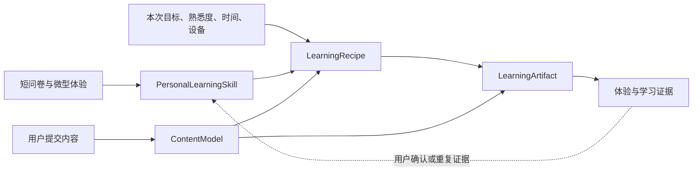
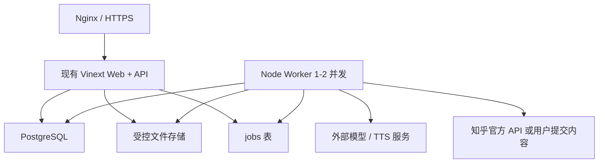

# 知径：研究结论与下一阶段落地方案

> 状态：研究结论与实施蓝图，不代表这些后端能力已经上线
>
> 日期：2026-08-29
>
> 适用阶段：从前端 Demo 进入第一条真实学习闭环

## 0. 最终判断

知径值得继续做，但产品地基不应该是“识别用户属于哪一种学习类型”，也不应该是“把文章批量转成各种媒体”。更可靠、也更容易验证的产品核心是：

```text
可编辑的个人学习 Skill
× 可追溯的文章知识模型
× 本次目标、先验知识、时间与设备
→ 可解释的学习配方
→ 来源一致的学习作品
→ 理解、迁移和延迟保持证据
```

下一阶段应只打通一条最短的真实链路：

> 用户完成一次短问卷 → 粘贴文章正文并保留知乎链接 → 系统形成知识结构 → 推荐一份学习配方 → 生成一件文字、关系图和轻互动组成的学习作品 → 完成一个应用题。

暂时不要先做视频、学习社区、排行榜、多平台采集和庞大学习库。它们都会放大成本，却不能先回答“个性化编排是否真的帮助理解”这个核心问题。

## 1. 研究边界

本文把结论分为三种：

- **研究事实**：论文、标准、官方文档或当前实测直接支持的内容；
- **方案判断**：基于证据和当前项目条件做出的产品、技术取舍；
- **待验证假设**：必须通过知径自己的用户实验才能确认的部分。

本轮研究覆盖学习风格、学习者模型、先验知识与支架、认知参与、多媒体学习、知识颗粒度、提取练习、来源锚点、知乎接入、生成式 AI 风险、效果评估和当前 4 核 8G 服务器。

研究限制也需要保留：部分出版社全文受访问限制，相关结论使用了可访问的摘要、作者公开稿或开放全文；Semantic Scholar 等学术接口出现过 HTTP 429。本文不把产品条款研究写成法律意见，正式商用前仍需按届时合同和实际数据流做专项合规确认。

## 2. 六条核心研究结论

### 2.1 不建立固定“视觉型、听觉型、情绪型”人格

2024 年一项学习风格匹配元分析纳入 21 项研究、101 个效应量和 1,712 名参与者。它观察到小幅总体效应，但只有约 26% 的学习结果呈现支持匹配假设所需的交叉效应；作者认为效果过小、出现不频繁、研究质量有限，不足以支持广泛采用。[Frontiers 原文](https://www.frontiersin.org/journals/psychology/articles/10.3389/fpsyg.2024.1428732/full)

因此：

- 文字、图解、故事、音频和视频偏好可以影响“是否愿意进入”；
- 它们不能单独证明“用户通过这种媒体学得更好”；
- 用户喜欢情绪和故事是有效体验信号，但应被记录为一种进入方式或解释方式，而不是人格诊断；
- 同一个用户面对不同内容、目标和状态，可以使用不同学习路径。

### 2.2 先验知识比年龄和媒体偏好更应该控制支架

2025 年专家逆转效应元分析纳入 60 项实验研究、176 个效应量和 5,924 名参与者。低先验知识学习者更受益于高支架，高先验知识学习者则可能被过多支架拖累；但研究间异质性很高，领域和教育阶段仍会影响效果。[Learning and Instruction 原文](https://doi.org/10.1016/j.learninstruc.2025.102142)

所以知径每篇文章开始前都应补充一个低负担问题：“你对这个主题有多熟？”年龄只用于语言、案例、信息密度、可访问性和未成年人保护，不用于推断能力或固定学习方式。

### 2.3 个性化必须可见、可纠正，而且只能从低置信度开始

一项涵盖 2013—2023 年 57 项研究的自适应学习者模型综述指出，许多系统缺少选择学习者特征的明确理论或实证理由，也缺少完整的自适应评估。[Computers & Education 摘要](https://www.sciencedirect.com/science/article/abs/pii/S0360131524001982)

这意味着问卷不能输出“系统已经懂你”的结论。它只能形成一份带证据、置信度和适用条件的 Skill 初稿。用户必须能看见系统为什么这样判断、能够直接修改，并且后续行为证据不能在用户不知情时永久改写画像。

### 2.4 “互动”必须产生新信息，点击不算学习

ICAP 框架区分 Passive、Active、Constructive 和 Interactive 四种认知参与，提出从被动接收到生成解释、再到共同建构，学习通常会更深入。它同时强调的是学习者的外显认知活动，不是界面动画或按钮数量。[ICAP 原文](https://doi.org/10.1080/00461520.2014.965823)

所以知径里的有效互动应是：复述、解释原因、补全关系、判断新案例、比较两个解释或与 AI 对话修正理解。翻卡、点亮节点和拖动动画只能作为操作形式，不能被统计为学习效果。

### 2.5 媒体不是越多越好，冗余会增加无关加工

多媒体学习研究中的一致性、信号、冗余、空间邻近和时间邻近原则都指向同一件事：媒体要帮助识别和组织关键信息，多余材料可能让学习者处理与目标无关的信息。[Cambridge Handbook 章节摘要](https://www.cambridge.org/core/books/abs/cambridge-handbook-of-multimedia-learning/principles-for-reducing-extraneous-processing-in-multimedia-learning/F29A19FCD34C542806F736E0661C05F5)

因此“同时生成文字、图片、音频和视频”不应是默认配方。每种媒体必须回答一个问题：它是否表达了纯文字不容易表达的空间、时间、因果或操作关系？如果没有，就不生成。

### 2.6 看完、喜欢和学会是三件不同的事

提取练习研究表明，即时重复阅读可能让人短期感觉更熟，但延迟测试中主动提取通常更有利于保持。经典实验分别在 5 分钟、2 天和 1 周后测量结果，显示即时表现和延迟保持可能方向不同。[Roediger 与 Karpicke 研究](https://pubmed.ncbi.nlm.nih.gov/16507066/)

因此知径必须把指标分开：

- **体验**：是否喜欢、是否愿意继续、主观负担；
- **行为**：是否完成、是否切换解释方式、耗时；
- **学习**：能否回忆、解释、判断和迁移到新案例；
- **保持**：若用户愿意，数日后是否仍能完成平行任务。

## 3. 产品的正式中间结构

平台最重要的不是页面数量，而是下面三份中间结构。所有模型和媒体都围绕它们工作。



### 3.1 个人学习 Skill

个人 Skill 不是一段人格描述，而是一组 AI 可执行、用户可阅读和修改的条件规则。

```ts
type PersonalLearningSkill = {
  version: number;
  profile: {
    ageStage?: "18-24" | "25-34" | "35-44" | "45-59" | "60+";
    accessibility: string[];
  };
  defaults: {
    goal: "quick-understand" | "build-structure" | "remember" | "apply" | "explain";
    entry: "question" | "map" | "case" | "story" | "definition";
    depth: "light" | "medium" | "deep";
    pace: "continuous" | "chunked" | "checkpointed";
    interaction: "minimal" | "constructive" | "dialogue";
    mediaPreferences: Array<"text" | "diagram" | "audio" | "video" | "interactive">;
  };
  rules: Array<{
    id: string;
    when: Record<string, string | number | boolean>;
    then: Record<string, string | number | boolean>;
    because: string;
    confidence: number;
    evidenceIds: string[];
    status: "provisional" | "user-confirmed" | "behavior-supported" | "rejected";
  }>;
  avoid: string[];
  updatedAt: string;
};
```

第一版短问卷建议保持 6 题，加一个不超过一分钟的微型体验：

| 输入 | 真正影响的规则 | 不应该推断什么 |
|---|---|---|
| 年龄阶段 | 语言、案例、密度、可访问性 | 智力和能力上限 |
| 当前长期目标 | 默认任务类型 | 所有文章都用同一目标 |
| 陌生主题从哪里进入 | 问题、地图、案例、故事、定义的默认入口 | 固定学习人格 |
| 卡住时什么最有帮助 | 支架和解释切换 | 媒体偏好等于学习效果 |
| 愿意被怎样打断 | 检查点密度和互动方式 | 越多互动越好 |
| 什么最容易让你退出 | 避免项、篇幅和节奏 | 一次回答永久有效 |
| 同概念双版本微型体验 | 偏好与实际理解分别记录 | 一次测试即可定型 |

每篇文章只动态询问两项：本次目标和主题熟悉度。时间可以从“8、20、35 分钟”选择，也可以接受系统默认。这样既减少决策负担，又补足最重要的上下文。

Skill 更新规则：

1. 问卷产生的规则默认 `provisional`，置信度较低；
2. 用户直接修改的规则标记为 `user-confirmed`；
3. 单次喜欢、完成或答对不自动升级成长期规律；
4. 同类内容上出现多次一致结果时，系统提出修改建议；
5. 用户确认后才写入新版本，旧版本保留可回退。

“多次”初始可暂定为至少 3 次一致证据，但这只是防止过拟合的产品阈值，必须在真实使用后调整，不是学习科学定律。

### 3.2 文章知识模型

内容颗粒度不按段落、字数或固定分钟切。KLI 框架把知识、学习事件和教学选择连接起来，并区分记忆与流畅、归纳与精炼、理解与意义建构等学习事件。[KLI 原文](https://onlinelibrary.wiley.com/doi/full/10.1111/j.1551-6709.2012.01245.x)

知径中的一个知识单元只有在满足下面至少一项时才值得独立建模：

- 可以被单独解释或练习；
- 可以通过用户行为判断是否理解；
- 掌握与否会改变下一步教学选择；
- 是其他知识单元的前置条件；
- 需要独立标注来源类型或不确定性。

```ts
type ContentModel = {
  source: {
    canonicalUrl?: string;
    title: string;
    author?: string;
    importedAt: string;
    importMethod: "official-api" | "user-paste" | "user-upload";
    normalizedTextHash: string;
  };
  centralQuestion: string;
  units: Array<{
    id: string;
    kind: "concept" | "relationship" | "procedure" | "argument" | "case";
    learningEvent: "memory" | "induction" | "sense-making";
    statementType:
      | "source-statement"
      | "author-inference"
      | "prediction"
      | "value-judgment"
      | "recommendation"
      | "external-verified";
    title: string;
    meaning: string;
    importance: "core" | "supporting" | "optional";
    sourceAnchorIds: string[];
    mediaAffordance: Array<"text" | "diagram" | "timeline" | "audio" | "video" | "interactive">;
    uncertainty?: string;
  }>;
  edges: Array<{
    from: string;
    to: string;
    type: "prerequisite" | "causes" | "supports" | "contrasts" | "example-of" | "sequence";
  }>;
};
```

特别要避免把文章作者说出的内容自动升级为外部事实。除非经过独立核验，否则统一标为“原文陈述”“作者推断”“预测”或“价值判断”。

### 3.3 来源锚点

每个知识单元和学习块都必须能回到原文位置。W3C Web Annotation 标准提供了 `TextQuoteSelector` 的 exact、prefix、suffix，以及 `TextPositionSelector` 的 start、end；标准同时提醒位置锚点会因原文变化而变脆弱，复制大段受版权保护文本也有风险。[W3C Web Annotation](https://www.w3.org/TR/annotation-model/)

第一版锚点建议同时保存：

```ts
type SourceAnchor = {
  id: string;
  sourceUrl?: string;
  snapshotHash: string;
  sectionPath?: string[];
  start: number;
  end: number;
  exactShortQuote?: string;
  prefix?: string;
  suffix?: string;
};
```

其中 `exactShortQuote` 只保留定位所需的短片段。是否保存完整正文、保存多久，必须由导入来源、授权方式和用户设置决定，不能一概永久保存。

### 3.4 学习配方

配方不是一次大模型自由发挥，而是一套先过滤、再选择、再编排、最后校验的决策过程。

```text
第一层：用户明确限制、无障碍与安全边界
第二层：本次目标、主题熟悉度、时间与设备
第三层：文章知识结构和媒体适配性
第四层：个人 Skill 的默认偏好
第五层：成本、延迟与生成能力
```

初版决策流程：

1. 应用硬限制，例如不使用音频、只用手机、最多 8 分钟；
2. 按目标选择核心知识单元，并补足必要前置关系；
3. 根据熟悉度决定支架强度和颗粒度；
4. 按内容关系选择表达器，而不是先选媒体；
5. 放置最多一到三个真正需要生成信息的检查点；
6. 估算时长，超过预算就先删可选单元，不压缩核心逻辑；
7. 输出每个选择的理由；
8. 校验所有源于文章的陈述都有锚点，AI 类比明确标记为类比。

为了可解释，第一版应以确定性规则为主，让模型只在规则允许的候选中补充编排。候选配方可使用一个可调排序分数：

```text
目标匹配 30%
+ 先验知识与支架匹配 25%
+ 内容结构匹配 20%
+ 时间、设备与可访问性 15%
+ 媒体和进入偏好 10%
```

这组权重是工程初值，不是研究结论。上线后必须通过效果数据调整。媒体偏好权重故意最低，防止再次滑回固定学习风格。

首批只提供三种配方：

| 配方 | 路径 | 适用目标 |
|---|---|---|
| 快速抓住 | 核心问题 → 关系图 → 关键解释 → 一个判断 | 8 分钟内理解主线 |
| 建立结构 | 问题 → 概念与因果地图 → 分段解释 → 案例 → 自我解释 | 系统理解文章 |
| 尝试应用 | 必要概念 → 示例推演 → 新情境任务 → 反馈 → 收束 | 把观点用于判断或行动 |

故事、情绪、音频和视频应作为配方内部的表达选择，而不是与“快速抓住”等目标并列的人格类型。

### 3.5 学习作品

所有媒体先共用一份学习作品结构，再分别渲染。这样同一篇文章的文字版、图解版和音频版不会各自重新理解原文。

```ts
type LearningArtifact = {
  id: string;
  sourceId: string;
  skillVersion: number;
  recipe: {
    goal: string;
    expectedMinutes: number;
    rationale: string[];
  };
  blocks: Array<{
    id: string;
    purpose: "question" | "map" | "explanation" | "example" | "practice" | "feedback" | "summary";
    knowledgeUnitIds: string[];
    sourceAnchorIds: string[];
    provenance: "source-derived" | "ai-explanation" | "ai-analogy" | "external-verified";
    canonicalContent: string;
    renderer: "text" | "diagram" | "audio" | "video" | "safe-interactive";
    accessibilityAlternative?: string;
    optional: boolean;
  }>;
};
```

第一件真实学习作品只做：文字、关系图和一个轻互动应用题。随后按以下顺序扩展：

1. **音频**：从已经校验的标准学习块生成 TTS，并提供文本稿；
2. **视频**：只用于时间变化、空间关系、操作过程或强叙事确有价值的内容；
3. **互动 HTML**：使用平台白名单组件 DSL 渲染，不执行模型自由生成的 JavaScript。

如果第一版就运行任意模型生成 HTML/JS，会同时引入脚本注入、数据泄露、行为不可复现和移动端兼容问题，得不偿失。

## 4. 知乎接入的真实结论

### 4.1 当前实测

2026-08-29 从当前开发环境实测：

- `https://www.zhihu.com/robots.txt` 返回 200；
- 其中通用 `User-Agent: *` 为 `Disallow: /`；
- 用户提供的两篇知乎专栏文章对当前服务端请求都返回 403；
- 因此“服务器收到公开链接后直接抓全文”不是一个当前稳定、可接受的默认方案。

知乎已经提供官方的[数据开放平台](https://developer.zhihu.com/)，页面说明搜索等 API 使用 Bearer 鉴权，目前处于邀测阶段，需要联系 `openplatform@zhihu.com` 申请，并根据使用场景和调用量沟通。官方平台是否提供“按任意文章 URL 获取完整正文”、允许怎样保存和二次生成，仍需通过接入合同确认，不能从搜索 API 介绍自行推断。

### 4.2 建议的三层导入策略

1. **正式生产首选：知乎官方数据平台或书面授权。** 它决定长期规模、可用性、计费和内容使用边界。
2. **核心闭环开发：用户主动粘贴正文、Markdown 或上传 HTML。** 同时填写原始 URL，只用于来源定位；这条路不需要等待官方 API 就能验证学习编排本身。
3. **浏览器辅助导入：待合规确认后再评估。** 如果采用，也应由用户在浏览器中主动选择内容，不由服务器绕过访问控制；仍不等于自动获得保存、改编或商用权利。

平台第一阶段应保持私人学习用途，不公开展示或分享完整原文和大段替代性内容。正式商用前需要根据实际数据流和知乎授权做版权与条款专项确认。这里是产品风险控制建议，不是法律结论。

如果未来接入允许服务端处理的其他网页，可使用 Mozilla Readability 提取标题、正文、作者、语言和发布时间，但它不负责清理不可信 HTML；官方文档建议配合 DOMPurify 和 CSP，并保持脚本与远程资源执行关闭。[Mozilla Readability](https://github.com/mozilla/readability)

## 5. 4 核 8G 服务器的落地架构

### 5.1 当前服务器实测

2026-08-29 的只读测量结果：

| 项目 | 当前值 |
|---|---|
| 系统 | Ubuntu 22.04 |
| CPU | 4 核 |
| 内存 | 7.4 GiB，总可用约 6.2 GiB |
| Swap | 4 GiB |
| 磁盘 | 178 GB，总剩余约 52 GB，已使用 70% |
| 当前负载 | 约 0.04 / 0.05 / 0.01 |
| 知径前端服务 | active，约 59 MB 内存，监听 `127.0.0.1:4329` |
| PostgreSQL / Redis / Docker | 当前未安装或未运行 |

这台机器足以承担前端、API、PostgreSQL、小规模任务队列和结果存储，但不适合在本机运行大模型、视频生成或高并发媒体转码。模型、TTS 和以后的视频能力应通过外部服务调用。

### 5.2 推荐部署形态



第一阶段不引入 Docker、Redis、Kafka、独立向量数据库和微服务。原因不是它们无用，而是当前并发和服务器规格下，它们会增加部署、备份和故障面。

使用 PostgreSQL 同时存业务数据和任务队列。官方文档明确说明 `FOR UPDATE SKIP LOCKED` 可用于多个消费者访问 queue-like table 时避免锁竞争。[PostgreSQL 文档](https://www.postgresql.org/docs/current/sql-select.html) 等并发或任务复杂度真实增长后，再将队列迁到专用系统。

建议的进程：

- `zhijing-web.service`：现有 Web 与 API，快速返回任务 ID；
- `zhijing-worker.service`：1—2 个并发，执行结构分析、生成和校验；
- `postgresql.service`：业务和任务数据；
- Nginx：沿用当前 `/zhijing/` 入口；
- `/home/ubuntu/apps/zhijing/shared/data`：哈希命名、限额、可清理的私有文件；进入公开试点后迁移到有备份策略的对象存储。

### 5.3 最小数据库表

| 表 | 作用 |
|---|---|
| `users` | 闭测用户或匿名会话，不存不必要身份资料 |
| `learning_skills` | Skill 版本、状态和用户确认记录 |
| `skill_evidence` | 问卷、体验、行为和学习证据 |
| `sources` | URL、标题、导入方式和权限状态 |
| `source_snapshots` | 哈希、保留策略和受控正文位置 |
| `source_anchors` | 章节、字符位置和短引用 |
| `content_models` | 文章知识单元、关系和版本 |
| `learning_recipes` | 本次输入、选择理由、权重和规则版本 |
| `learning_artifacts` | 学习作品元数据和生成状态 |
| `artifact_blocks` | 块内容、渲染器和来源锚点 |
| `jobs` | 后台任务、重试、错误和成本 |
| `learning_events` | 浏览、切换、回答等去标识事件 |
| `assessments` | 即时与延迟任务、评分和评分版本 |

### 5.4 最小 API

```text
POST   /api/skills/derive
GET    /api/skills/current
PATCH  /api/skills/current

POST   /api/sources/import
GET    /api/sources/:id

POST   /api/artifacts
GET    /api/jobs/:id
GET    /api/artifacts/:id

POST   /api/events
POST   /api/assessments
```

模型调用必须通过 provider adapter，并将提示词版本、模型、输入哈希、结构化输出和成本写入任务记录。生成结果先通过 JSON Schema、来源锚点覆盖和禁用类型校验，再进入渲染。

### 5.5 必须先做的安全边界

- 不接受任意协议，只允许明确支持的 `https` 来源；
- 当前知乎不走服务端自由抓取；未来若开放通用 URL，必须限制域名、解析并拒绝本地/私网 IP、禁用自动跳转、限制大小和超时；
- OWASP 明确把用户控制 URL 后由服务器访问视为 SSRF 风险，并建议优先使用允许列表、检查 IPv4/IPv6、DNS 和重定向。[OWASP SSRF 指南](https://cheatsheetseries.owasp.org/cheatsheets/Server_Side_Request_Forgery_Prevention_Cheat_Sheet.html)
- 不运行模型生成的任意脚本；互动只使用白名单组件；
- 模型密钥只在服务端环境中，绝不进入浏览器包；
- 原文、问卷和学习行为设定保留期限、导出和删除入口；
- 年龄只收阶段，不收生日。个人信息处理遵循目的明确和最小必要原则。[中国人大网《个人信息保护法》](https://www.npc.gov.cn/npc/c2/c30834/202108/t20210820_313088.html)

NIST 的生成式 AI 风险框架把 confabulation、数据隐私、信息完整性、知识产权和价值链风险列为需要管理的风险，并建议记录数据来源、假设、限制和评估过程。[NIST AI 600-1](https://nvlpubs.nist.gov/nistpubs/ai/NIST.AI.600-1.pdf) 对知径而言，这意味着“有来源锚点”是产品主结构，不是结果页面最后补一个参考链接。

## 6. 有效性怎样验证

知径现在能证明的是产品逻辑可演示，不能证明学习有效。下一阶段分三层验证，不能跳级。

### 6.1 第一层：系统正确性

不找用户之前先通过固定文章集验证：

- 原文导入是否完整；
- 原文陈述、作者推断、预测和价值判断是否分开；
- 每个 source-derived 学习块是否都有有效锚点；
- 图解、文字和互动是否使用同一知识模型；
- AI 类比是否明确标记，是否反客为主；
- 同一输入和规则版本是否得到结构稳定的输出；
- 失败时是否保留任务、可重试且不重复计费。

首批测试集使用两篇现有知乎样本，再补充概念解释、因果论证、操作流程和争议观点四种文章。知乎文章本体通过用户提供的合法可处理文本进入测试，不由服务器抓取。

### 6.2 第二层：可用性试点

先邀请约 8—12 名目标用户完成一次闭环，观察他们能否：

- 理解个人 Skill 是可调整规则，而不是性格报告；
- 在不需要解释的情况下提交内容；
- 接受推荐配方，或者只做一次必要修改；
- 区分原文、AI 解释和 AI 类比；
- 完成最后的应用题而不感觉被考试绑架。

这一阶段只找流程和理解问题，不能据此宣传有效性。

### 6.3 第三层：效果试验

对照条件不能故意做差。建议比较：

- **对照组**：原文 + 一份正常质量的结构化 AI 摘要；
- **实验组**：同一知识模型上生成的个人化学习配方与作品。

测量：

1. 学习前：主题熟悉度和一个简短基线题；
2. 学习后立即：主线理解、因果解释和新案例应用；
3. 约 72 小时后：使用平行题测延迟保持与迁移；
4. 同时记录时间、完成率、主观努力和偏好，但不把它们当成学习分数。

同一个人不能先后看同一文章的两种版本，否则前一版本会污染后一版本。可以在用户—文章层面随机分配，并让每位用户在不同但难度匹配的文章上经历两种条件。开放题使用预先写好的评分量规，评分者尽量不知道用户属于哪组；如果用模型辅助评分，必须先用人工样本校准，不能让生成内容的同一模型自己证明自己有效。

先用一个小型试点估计分数方差、退出率和实际完成时间，再做功效分析决定正式样本量。预先指定一个主要结果，例如“72 小时后的迁移得分”，其余作为次要结果，同时报告效应量与置信区间。教育研究的随机分配、基线等价和退出偏差可参考美国教育科学研究院 WWC 的现行标准资源。[WWC 标准手册入口](https://ies.ed.gov/ncee/WWC/Handbooks)

### 6.4 什么结果才允许更新个人 Skill

| 信号 | 可以说明 | 不可以说明 |
|---|---|---|
| 喜欢某种形式 | 进入意愿或体验偏好 | 学得更好 |
| 完成学习 | 流程可接受 | 已理解或记住 |
| 即时答对 | 当下可能理解 | 长期保持 |
| 延迟答对 | 有保持证据 | 这套方式对所有内容都有效 |
| 新案例应用成功 | 有迁移证据 | 永久学习人格已确定 |

系统只在跨多篇同类内容出现一致差异时提出 Skill 调整建议，并始终保留用户确认权。

## 7. 实施顺序与验收门槛

### 阶段 A：先冻结协议，不动视觉

产出：

- `PersonalLearningSkill`、`ContentModel`、`SourceAnchor`、`LearningRecipe`、`LearningArtifact` 的 JSON Schema；
- 6 题问卷到 Skill 规则的确定性映射；
- 三种配方的规则和冲突优先级；
- 两篇样本文章的人工黄金知识结构。

完成门槛：同一输入可以稳定得到可解释结构；产品、前端和后端使用同一 schema。

### 阶段 B：打通真实单用户闭环

产出：

- 用户粘贴正文或上传 HTML，并保留知乎 URL；
- 结构分析和来源锚点；
- 外部模型适配器和后台任务；
- 文字、关系图、轻互动学习作品；
- 即时应用题和结果记录。

完成门槛：页面里不再有固定演示文章；每个 source-derived 学习块都可回到来源；任务失败可见、可重试。

### 阶段 C：闭测基础设施

产出：

- PostgreSQL、版本迁移和备份；
- 邀请制用户或持久匿名身份；
- Skill 版本、学习作品和评估记录；
- 隐私告知、删除和数据导出；
- 8—12 人可用性试点。

完成门槛：用户跨会话仍能看到自己的 Skill 和作品；没有把体验指标写成学习效果。

### 阶段 D：效果试验

产出：

- 强对照版本；
- 随机分配、评分量规和延迟任务；
- 退出与缺失数据记录；
- 试点报告和正式实验样本量估计。

完成门槛：先得到“是否值得继续个性化”的可信方向，再决定音频、视频、长期学习库和更多内容平台。

### 阶段 E：知乎正式接入与媒体扩展

只有在核心学习闭环成立后再推进：

- 申请知乎数据开放平台并确认正文、保存和生成权限；
- 接入音频，再评估视频；
- 建立学习库、延迟复习和跨文章连接；
- 再扩展公众号、网页、PDF 或其他内容来源。

## 8. 当前明确不做的事

- 不把用户诊断成固定学习类型；
- 不因年龄推断能力；
- 不让问卷一次性决定永久 Skill；
- 不把所有文章默认转成视频；
- 不让每种媒体各自重新理解原文；
- 不服务端绕过知乎 403 或 robots 规则；
- 不执行模型自由生成的 HTML/JavaScript；
- 不用完成率、停留时间或满意度宣称学习有效；
- 不在核心闭环尚未成立时先建设庞大学习库和社交系统。

## 9. 下一步应该直接做什么

下一项开发任务应是“阶段 A + 阶段 B 的最小垂直切片”，而不是继续优化首页：

1. 把本文五个结构写成正式 JSON Schema 和 TypeScript 类型；
2. 选择用户提供的其中一篇文章，由用户粘贴可处理正文；
3. 人工建立黄金知识结构和来源锚点；
4. 接通一个模型，把正文转成同结构候选；
5. 让确定性配方引擎生成“快速抓住”作品；
6. 在现有学习页面真实渲染，并完成一个应用判断；
7. 用黄金结构检查遗漏、错分、无锚点和 AI 越界。

这条切片完成后，知径才从“好看的产品想法”真正变成“可以验证的一次学习系统”。
